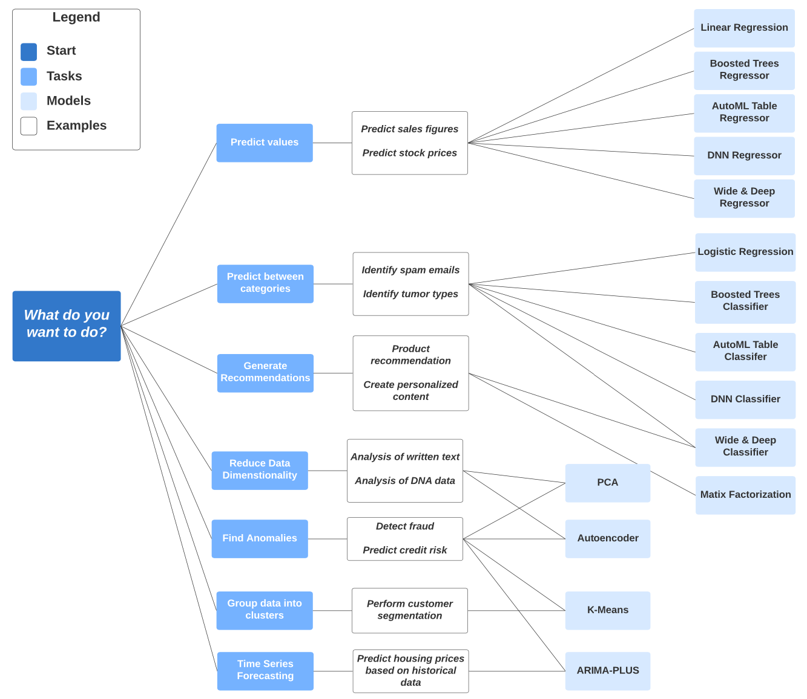

# BigQuery Machine Learning


## Extract model
See and run big_query_ml.sql first in bigquery.
```
gcloud auth login
bq --project_id ny-rides-mazaya extract -m trips_data_all.tip_model gs://taxi_ml_model_mazaya/tip_model
mkdir /tmp/model
cd /tmp/model
gsutil cp -r gs://taxi_ml_model_mazaya/tip_model /tmp/model
mkdir -p serving_dir/tip_model/1
cp -r /tmp/model/tip_model/* serving_dir/tip_model/1
docker pull tensorflow/serving

docker run \
  -p 8501:8501 \
  --mount type=bind,source=`pwd`/serving_dir/tip_model,target=/models/tip_model \
  -e MODEL_NAME=tip_model \
  -t tensorflow/serving &

# in another terminal
curl -d '{"instances": [{"passenger_count":1, "trip_distance":12.2, "PULocationID":"193", "DOLocationID":"264", "payment_type":"2","fare_amount":20.4,"tolls_amount":0.0}]}' -X POST http://localhost:8501/v1/models/tip_model:predict
# should show "predictions": [0.84882555946205684]

http://localhost:8501/v1/models/tip_model
```