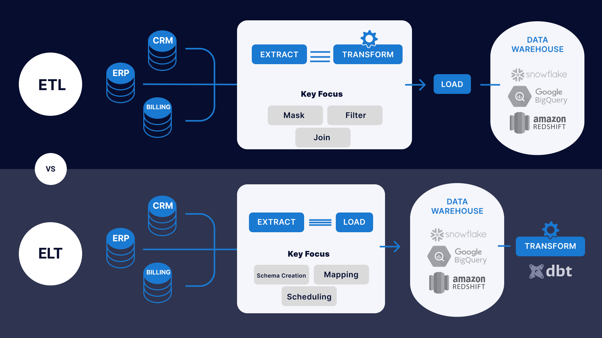
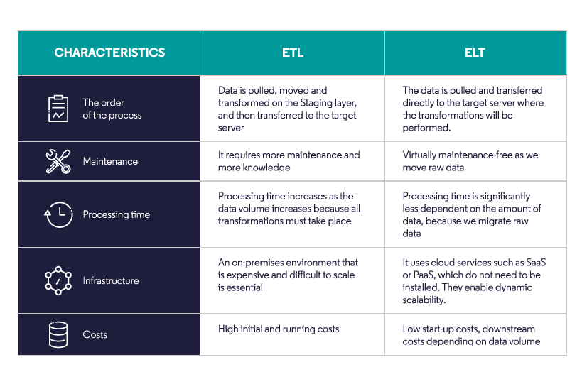
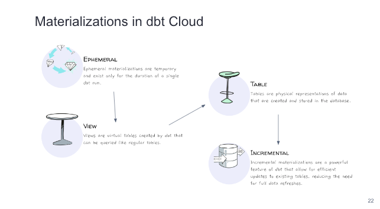
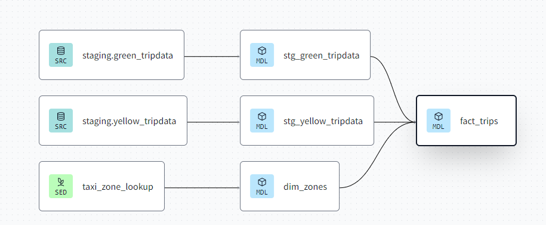

# Intro to Analytics Engineering

## Prerequisites
1. Have BigQuery or Postgres
2. Completed week3
3. Datasets > I use Bigquery to create this dataset to save time
    * Yellow taxi data - 2019 and 2020
    * Green taxi data - 2019 and 2020
    * fhv data - 2019
    ***go to taxi_rides_ny/analyses/hack-load-data.sql***
    ***fhv is homework***

## What is Analytics Engineering?
### Roles
1. Data Engineer prepares and maintains the infrastructure the data team needs.
2. Data Analyst uses data to answer questions and solve problems.
4. Analytics engineer is the role that tries to fill the gap: More software to Data Analyst and more Data to Data Engineer. The analytics engineer may be exposed to the following tools: 
    * Data Loading (Stitch...)
    * Data Storing (Data Warehouses)
    * Data Modeling (dbt, Dataform...)                              > we focus here
    * Data Presentation (BI tools like Looker, Mode, Tableau...)    > we focus here

### Tools for Data:
1. Massively parallel processing (MPP) databases
    * Lower the cost of storage 
    * BigQuery, Snowflake, Redshift...
2. Data-pipelines-as-a-service
    * Simplify the ETL process
    * Fivetran, Stitch...
3. SQL-first / Version control systems
    * Looker...
4. Self service analytics
5. Data governance

### ETL vs ELT



# Introduction to dbt
***dbt*** stands for ***data build tool***. It's a transformation tool, transform raw data in Data Warehouse to transformed data which can be later used by Business Intelligence tools and any other data consumers. dbt also allows us to introduce good software engineering practices by defining a _deployment workflow_: Develop models, Test and document models, and Deploy models with _version control_ and _CI/CD_.

## dbt works
dbt works by defining a ***modeling layer*** that sits on top of our Data Warehouse. The modeling layer will turn _tables_ into ***models*** which we will then transform into _derived models_, which can be then stored into the Data Warehouse.
A ***model*** is a .sql file with a `SELECT` statement; no DDL or DML is used. dbt will compile the file and run it in our Data Warehouse.

## How to use dbt?
dbt has 2 main components: _dbt Core_ and _dbt Cloud_:
1. ***dbt Core***: open-source project that allows the data transformation.
    * Builds and runs a dbt project (.sql and .yaml files).
    * Includes SQL compilation logic, macros and database adapters.
    * Includes a CLI interface to run dbt commands locally.
    * Open-source and free to use.
2. ***dbt Cloud***: SaaS application to develop and manage dbt projects.
    * Web-based IDE to develop, run and test a dbt project.
    * Jobs orchestration.
    * Logging and alerting.
    * Intregrated documentation.
    * Free for individuals (one developer seat).
For integration with BigQuery, use dbt Cloud IDE, so a local installation of dbt core isn't required. For developing locally, use dbt Core + local Postgres database, which can be installed locally and connected to Postgres and run models through the CLI.

# Starting dbt
1. Make account and login in dbt Cloud
2. Connect json from GCP project and also github
3. Select github directory and sub directory (account setting > project > edit)
4. Back to Cloud IDE, click ***Initialize..***
5. then click ***commit and sync***, it will create a new branch, just PR and merged.

# Developing dbt
## Anatomy of dbt model
Raw Data > Develop > Test&Document > Deploy > Dataset > BI Tools/ML Model/Analytics.
We're exploring **Develop** and **Test&Document**.

***dbt model***
```
# Jinja statement {{}}
{{
    config(materialized='table')
}}

SELECT *
FROM staging.source_table
WHERE record_state = 'ACTIVE'
```
***compiled code***
```
CREATE TABLE my_schema.my_model AS (
    SELECT *
    FROM staging.source_table
    WHERE record_state = 'ACTIVE'
)
```
### Materialization in dbt Cloud



## The ***FROM*** Clause
### Source
Source is where data lives/stored (database, data warehouse, dbt models).
Here's an example of how to declare a source in a .yml file:
```
sources:
    - name: staging
      database: production
      schema: trips_data_all

      loaded_at_field: record_loaded_at
      tables:
        - name: green_tripdata
        - name: yellow_tripdata
          freshness:
            error_after: {count: 6, period: hour}
```
### FROM clause
The FROM clause tells where to find the data that will be used in a model.
```
FROM {{ source('staging','yellow_tripdata') }}
```
### ref() function
The ref() function references underlying tables in the Data Warehouse. When compiled, it will automatically build the dependencies and resolve the correct schema fo us. So, if BigQuery contains a schema/dataset called **dbt_dev** inside the **my_project** database which we're using for development and it contains a table called **stg_green_tripdata**, then the following code...
```
WITH green_data AS (
    SELECT *,
        'Green' AS service_type
    FROM {{ ref('stg_green_tripdata') }}
),
```
...will compile to this:
```
WITH green_data AS (
    SELECT *,
        'Green' AS service_type
    FROM "my_project"."dbt_dev"."stg_green_tripdata"
),
```

# Creating a model
## The first step
1) Create a directory under models (ex: staging), could delete example folder too
2) make ***schema.yml***, link to database and schema from BigQuery
3) after specify table name (ex: green_trip), click ***Generate model***, can move and rename the model sql (ex: stg_green_tripdate.sql).

## Create a macros function
Jinja template for delimiters:
*  for statements (control blocks, macro definitions)
* {{ ... }} for expressions (literals, math, comparisons, logic, macro calls...)
* {# ... #} for comments.
Using jinja, it is a **function** like def in python that is going to allow us to generate code.
Macros allows us to make abstract code into something like **{{source and ref}}**, of to simplify heavily repeated code.
1) make an sql file under macro folder (ex: get_payment_type_desc.sql)
2) put the function into the model sql (ex: stg_green_tripdate.sql). Click compile

...macros like a def in one project, if want something for another project, in dbt use packages

## Create a package
Just like a library in other programming lang, a standalone dbt project (with models and macros) that tackle a specific problem area. Imported in **packages.yml**, can see useful package in dbtHub.
1) create packages.yml in the same folder as dbt_project.yml
2) running `dbt deps` to install eveything from the packages
3) I used ***surrogate key from dbt utils package*** in this project
3) same as macro, put the function into the model sql. Click compile you will see Hex, then Click Build. Can see build model output in target folder and BigQuery (refresh first).

## Variables
It is for defining values that should be used accross the project. It can be defined in to ways:
* Under the vars keyword inside dbt_project.yml
```
vars:
    payment_type_values: [1, 2, 3, 4, 5, 6]
```
* As CLI when building or running your project
```
--dbt build --m <your-model.sql> --var 'is_test_run': false


    limit 100


```
Define variables in your sql model (ex: 'is_test_run')

## Seeds
Seeds are like starting point/foundation. We can load static data like csv.
In the case of seeds, assuming **taxi_zone_lookup.csv** file in seeds folder which contains ***locationid, borough, zone and service_zone***:
```
SELECT
    locationid,
    borough,
    zone,
    replace(service_zone, 'Boro', 'Green') as service_zone
FROM {{ ref('taxi_zone_lookup) }}
```
If you build the seed, it can appear in BigQuery under the same folder.

## Referencing other model
Making `fact_trips.sql` that depends on its child models

This `fact_trips.sql` actually do union for all these 3 models before (note: dim_zones is from seed), so this is how to run this kind of model:
```
-- build +model+ (up/downstream)
dbt build --select +fact_trips+
```

# Testing and Developing dbt model
## Testing
* testing is essentially a `select` sql query and defined in .yml file
* dbt provides basic test to check if the columns are:
    1. Unique
    2. Not null
    3. Accepted values
    4. A foreign key to another tables
* But we can create customs tests as queries

**Steps:**
1) create a model under `core/dm_monthly_zone_revenue.sql` to calculate revenue each month. It uses macro `dbt.date_trunc`.
2) add `dbt.codegen` to packages.yml that is to generate code (ex: yaml of the model). Run `dbt deps` to install package.
3) compile this code and put the result into into schema.yml, can also copy from DEZC GitHub, dont forget to alter dbt_project.yml for variable or seeds.
```

{{ codegen.generate_model_yaml(
    model_names = models_to_generate
) }}
```
4) run `dbt build` for full tests.

## Documentation
dbt provides a way to geneare documentation and render it as a website. It includes:
* Project info (model code, sources, descriptions, and tests)
* DWH info (column name, column dtype, table size, table rows)

**Steps:**
1) compile this code and copy the result for new `schema.yml` under core model
```

{{ codegen.generate_model_yaml(
    model_names = models_to_generate
) }}
```
2) Also can take from DEZC GitHub, then run
```
dbt docs generate
```

# Deployment
End to end workflow be like:
1) Develop in user branch
2) Open PR to merge into the main branch, merge
3) Run the new models in the production env using the main branch
4) Schedule the models

**Steps:**
1) In header, click deploy > environment > create environment for production (datase: prod)
2) Click Create job > Deploy job > Fill the job settings > Select docs on run and source freshness > edit the build so can build full rows to:
```
dbt build --vars '{'is_test_run': false}'
```
3) Can schedule hours > 12 > exc Sat and Sun > and Save
4) Make sure to merge to Main branch first.
5) Also can run with API if we use like Airflow that load fresh data to our BigQuery that will trigger the dbt run.
6) Run it manually until finished. After that we can see our json metadata under artifacts, commit under Commit SHA, and Documentation too.

## Continuous Integration (CI)
CI is practice of regularly merge development branches after which automated builds and tests are run. Dbt allows us to enable CI on PR via webhooks from GitHub, when PR is ready to merged a webhooks will enqueue a new run of the specified job.
The run of the CI job will be against a temp schema and no PR will be able to be merged unless the run has been completed successfully.

**Steps:**
1) Click Deploy > Jobs > Create job > CI job > Fill in job settings that triggered by PR
2) Also can add or change advanced settings. > Save
3) make changes to the script > commit > create PR > you can see dbt Cloud in PR trigger a run > it should be pass first (can see details) before merging.