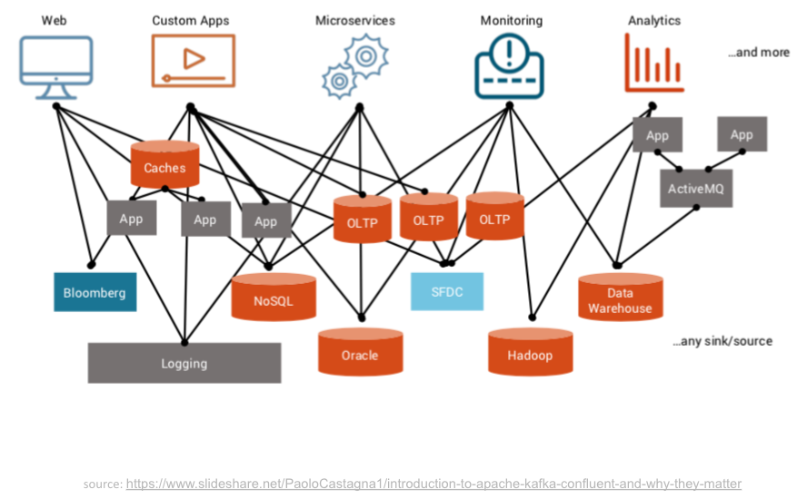

# Introduction to streaming and Kafka
The data that we got is real time, meaning it's in very short interval. We will process this strean data immidiately make it is a stream processing.
Apache Kafka is a message broker, it is an open-source distributed event streaming platform for high-performance data pipelines, streaming analytics, data integration, and mission-critical applications. It simplifies project from this...

to this...

In a topic, we will get many messages from events that happened. Each message have **key, value, and timestamp**, *value* is actually the data exchange that you want.

###
